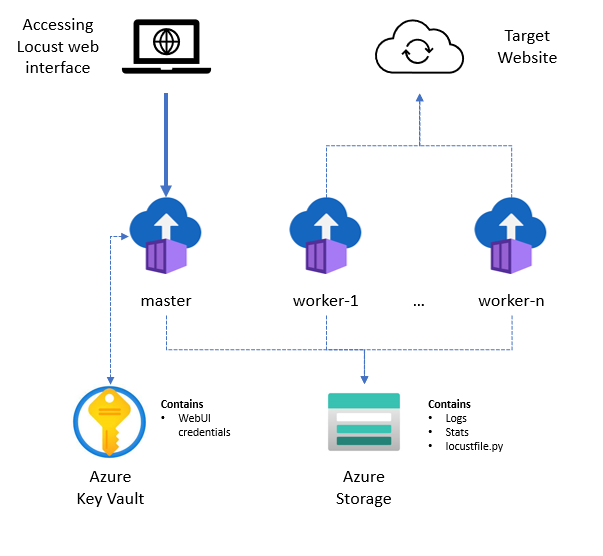

# Locust on Azure Container Instances (ACI)

Load testing with [Locust](https://locust.io) using Azure Container Instances (ACI). This repository contains sample implementations in Terraform how to deploy and run load tests with Locust.

## Locust deployment via Terraform

This repository contains two different Terraform definitions to deploy Locust:

* [headless](./src/headless/infra) - To conduct fully automated load tests without a user interface triggered via a GitHub workflow.
* [webui](./src/testing/infra) - To deploy a load testing infrastructure with multiple worker nodes and a webui to conduct and monitor tests.

## Locust deployment pipelines

### Headless

The "headless" workflow asks upfront for all required information to conduct the load test:

* Number of Locust worker nodes
* Duration in minutes
* The rate per second in which users are spawned
* Number of concurrent Locust users
* Locust target URL

The workflow will then, based on your selection, deploy the required infrastructure in Azure, conduct the load test as defined, store the results in it's Azure Storage Account and scale down the infrastructure back to 0 - except its Storage Account.

### WebUI

The "webui" workflow spins up a full Locust deployment with the selected number of worker nodes. You can run the same pipeline again to scale the infrastructure down.

